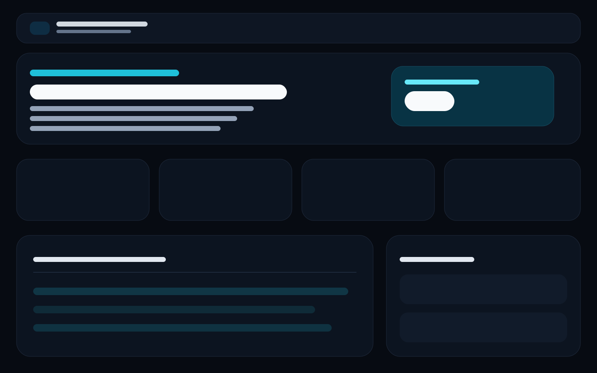
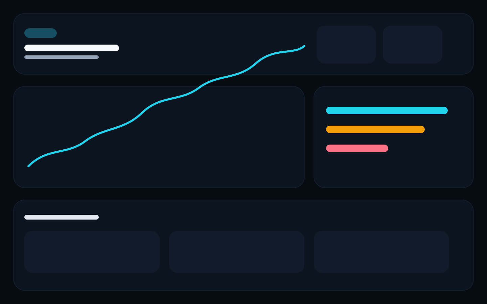
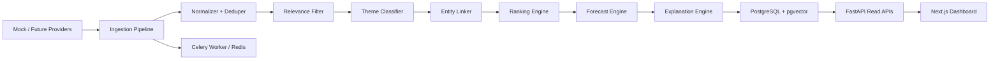

# NewsAlpha

한국 주식 뉴스 기반 매매 보조를 위한 풀스택 MVP입니다.  
국내/해외 뉴스를 수집하고, 주식 관련성 필터를 거쳐 투자 테마로 분류한 뒤, 한국 상장 종목과 연결하여 상위 수혜 종목 랭킹, 설명 카드, 단기 확률형 예측 위젯까지 제공합니다.

주요 목표:
- 한국 주식을 우선 대상으로 삼는다.
- 미국/해외 뉴스도 반영하되 한국어 번역 요약과 국내 영향 해석을 함께 제공한다.
- 뉴스 나열이 아니라 `뉴스 -> 테마 -> 종목 -> 예측 -> 설명` 흐름을 완결한다.
- 모든 예측은 확률 기반 보조 정보로 표시하며 투자 조언처럼 보이지 않게 설계한다.

## 스크린샷




## 기술 스택

- Frontend: Next.js, TypeScript, Tailwind CSS, shadcn/ui 스타일 컴포넌트
- Backend: FastAPI, SQLAlchemy, Celery
- Data: PostgreSQL, Redis, pgvector
- ML: pandas, polars, scikit-learn, LightGBM, PyTorch
- Repo: polyglot monorepo

## 디렉터리 구조

```text
apps/
  api/      FastAPI 백엔드, 시드, 파이프라인, 테스트
  web/      Next.js 앱, 대시보드/상세 페이지
packages/
  shared/   공용 타입, 포맷터, mock seed JSON
ml/         베이스라인 모델, 피처 빌더, 평가 리포트
infra/      docker-compose, Dockerfiles, env 템플릿, 실행 스크립트
docs/       설계 문서와 스크린샷
```

초기 설계 문서는 [docs/implementation-plan.md](docs/implementation-plan.md) 에 있습니다.

## 아키텍처



### 구현 트레이드오프

- 실시간 API 대신 mock-first 설계를 채택했다.
  이유: 초기 단계에서 전체 사용자 흐름을 안정적으로 검증하고, 나중에 provider adapter만 교체하기 위함.
- 단일 거대 모델 대신 분리형 모듈을 사용했다.
  이유: 관련성 필터, 테마 분류, 랭킹, 예측을 독립적으로 교체/평가하기 쉽다.
- 백엔드는 PostgreSQL/pgvector 경로를 유지하되 테스트는 SQLite에서도 생성 가능한 타입으로 설계했다.
  이유: CI/로컬에서 빠른 테스트를 허용하면서 프로덕션 스택 요구사항을 유지하기 위함.
- 프론트엔드는 서버 컴포넌트 중심으로 구성하고 차트/운영 액션만 클라이언트 컴포넌트로 남겼다.
  이유: 데이터 읽기 흐름을 단순화하고 초기 성능과 구조를 안정적으로 유지하기 위함.

## 기능 요약

### 1. 뉴스 수집 및 정제 파이프라인

- 국내/해외 provider 인터페이스 분리
- 정규화와 dedupe hash 기반 중복 제거
- 주식 관련성 필터
- 멀티라벨 테마 분류
- 기사 클러스터 생성
- 한국 종목 연결과 설명 카드 생성
- PostgreSQL 저장

### 2. 종목 연결 및 랭킹

- 종목 마스터와 테마 링크 테이블
- 기사 엔티티 -> 국내 상장 종목 매핑
- 기사/클러스터/대시보드 스냅샷 랭킹
- 상승 잠재 관련성 점수 기반 Top 10 출력

### 3. 예측 위젯

- 단기 방향성 확률
- 종가 밴드
- 장중 시간 구간별 전망
- 설명 가능한 feature snapshot
- 확률 기반 보조 정보라는 고지 문구 포함

### 4. 운영/리뷰 화면

- 파이프라인 상태 페이지
- mock ingest 재실행/리셋 버튼
- 내부 모델 평가 페이지

## 주요 페이지

- `/` 대시보드 홈
- `/themes` 테마 목록
- `/themes/[slug]` 테마 상세
- `/articles` 필터링된 뉴스 목록
- `/articles/[id]` 기사 상세
- `/stocks` 관찰 종목 목록
- `/stocks/[ticker]` 종목 상세, 차트, 예측, 타임라인
- `/admin/ops` 운영 상태
- `/admin/evals` 모델 평가

## API 개요

### Public

- `GET /api/v1/health`
- `GET /api/v1/dashboard`
- `GET /api/v1/themes`
- `GET /api/v1/themes/{theme_slug}`
- `GET /api/v1/articles`
- `GET /api/v1/articles/{article_id}`
- `GET /api/v1/clusters`
- `GET /api/v1/clusters/{cluster_id}`
- `GET /api/v1/stocks`
- `GET /api/v1/stocks/{ticker}`
- `GET /api/v1/stocks/{ticker}/forecast`
- `GET /api/v1/stocks/{ticker}/timeline`

### Admin

- `GET /api/v1/admin/pipeline-status`
- `POST /api/v1/admin/ingest/run`
- `POST /api/v1/admin/seed/reset`
- `GET /api/v1/admin/evaluations`
- `GET /api/v1/admin/evaluations/{model_name}`

## 데이터 모델

핵심 테이블:

- `articles`
- `article_clusters`
- `themes`
- `stocks`
- `stock_theme_links`
- `stock_news_links`
- `forecasts`
- `ranking_snapshots`
- `explanation_cards`
- `market_prices`
- `foreign_news_impacts`

세부 설계는 [docs/implementation-plan.md](docs/implementation-plan.md) 에 정리되어 있습니다.

## 로컬 실행

### 사전 준비

- Docker Desktop 또는 Docker Engine
- `docker compose` 명령 사용 가능 환경
- Windows 의 경우 WSL2 및 가상화가 활성화된 상태 권장

### 1. 환경 변수 준비

```bash
cp .env.example .env
```

Windows PowerShell에서는 다음처럼 복사해도 됩니다.

```powershell
Copy-Item .env.example .env
```

### 2. 전체 스택 실행

```bash
docker compose -f infra/docker-compose.yml up --build
```

실행 후 접속:

- Web: [http://localhost:3000](http://localhost:3000)
- API Docs: [http://localhost:8000/docs](http://localhost:8000/docs)
- API Health: [http://localhost:8000/api/v1/health](http://localhost:8000/api/v1/health)

### 3. 운영 액션

mock ingest 재실행:

```bash
curl -X POST http://localhost:8000/api/v1/admin/ingest/run
```

시드 리셋:

```bash
curl -X POST http://localhost:8000/api/v1/admin/seed/reset
```

PowerShell 스크립트:

```powershell
./infra/scripts/dev.ps1
./infra/scripts/seed.ps1
```

## 개발 모드

### Backend

```bash
cd apps/api
pip install -e .[dev]
uvicorn app.main:app --reload
```

Windows 가상환경 예시:

```powershell
.\.venv\Scripts\python.exe -m pip install -e .\apps\api[dev]
.\.venv\Scripts\python.exe -m uvicorn app.main:app --app-dir .\apps\api --reload
```

### Frontend

```bash
npm install
npm --workspace apps/web run dev
```

### ML

```bash
cd ml
pip install -e .[dev]
python scripts/train_baselines.py
python scripts/evaluate_models.py
```

Windows 가상환경 예시:

```powershell
.\.venv\Scripts\python.exe -m pip install -e .\ml[dev]
.\.venv\Scripts\python.exe .\ml\scripts\train_baselines.py
.\.venv\Scripts\python.exe .\ml\scripts\evaluate_models.py
```

## 테스트

### Backend

```bash
cd apps/api
pytest
```

Windows:

```powershell
.\.venv\Scripts\python.exe -m pytest -p no:cacheprovider .\apps\api
```

### ML

```bash
cd ml
pytest
```

Windows:

```powershell
.\.venv\Scripts\python.exe -m pytest -p no:cacheprovider .\ml
```

루트에서 실행:

```bash
npm run test:api
npm run test:ml
```

## Mock 데이터 흐름

현재 mock seed는 다음 흐름을 보장합니다.

1. 해외 AI/HBM 기사 -> AI 인프라 테마 -> SK하이닉스/한미반도체/이수페타시스 연결
2. 전력망/HVDC 기사 -> 전력망·원전 테마 -> LS ELECTRIC/HD현대일렉트릭/두산에너빌리티 연결
3. 유럽 방산 기사 -> 방산·우주 테마 -> 한화에어로스페이스/LIG넥스원 연결
4. 미국 ESS 기사 -> 2차전지 + 전력기기 파급 해석
5. 각 종목 상세 페이지에서 예측 위젯, 근거 카드, 타임라인 표시

## 실제 데이터 교체 지점

### TODO: 실뉴스 Provider Adapter

- `apps/api/app/services/pipeline/providers/base.py`
- 현재 `mock_domestic.py`, `mock_foreign.py` 를 실제 뉴스 API adapter로 교체 가능

### TODO: 실시간 시세/호가 Adapter

- `apps/api/app/services/pipeline/forecaster.py`
- 현재 mock 가격 시계열을 실제 국내 시세 API 또는 유료 데이터 피드로 교체 가능

### TODO: 공시/정책 데이터 Adapter

- 엔티티 링커와 랭킹 피처에 공시, 정책 발표, 수주 공시를 결합할 수 있음

### TODO: 임베딩 생성기

- `articles.embedding` 은 현재 mock vector
- 실제 multilingual embedding 또는 금융 도메인 임베딩으로 교체 가능

## 구현 상태

- 모노레포 구조 완료
- FastAPI + SQLAlchemy + seed pipeline 완료
- Next.js 대시보드/상세 화면 완료
- PostgreSQL + Redis + worker Docker stack 완료
- ML baseline package 및 평가 리포트 완료
- README, env template, scripts 완료

## 참고

- 설계 기준점: [docs/implementation-plan.md](docs/implementation-plan.md)
- 공용 mock 데이터: [packages/shared/data/mock-seed.json](packages/shared/data/mock-seed.json)
- 백엔드 진입점: [apps/api/app/main.py](apps/api/app/main.py)
- 프론트엔드 진입점: [apps/web/app/page.tsx](apps/web/app/page.tsx)

## Windows Docker Preflight

Windows에서 `docker compose`가 바로 실행되지 않으면 먼저 아래 점검 스크립트를 실행하세요.

```powershell
.\infra\scripts\windows-preflight.ps1
```

WSL 또는 Docker Desktop이 없다고 나오면 관리자 권한 PowerShell에서 아래 스크립트를 실행합니다.

```powershell
.\infra\scripts\windows-enable-docker-prereqs.ps1 -InstallDockerDesktop
```

첫 실행에서 Windows 기능 활성화만 끝나고 재부팅을 요구할 수 있습니다. 그 경우 재부팅 후 같은 명령을 한 번 더 실행하면 됩니다.

재부팅 후 전체 스택은 다시 아래처럼 실행하면 됩니다.

```powershell
.\infra\scripts\dev.ps1
```

자세한 Windows 복구 절차는 [docs/windows-docker-troubleshooting.md](docs/windows-docker-troubleshooting.md)에 정리했습니다.
